[English](README.md) | 简体中文

# YanamiNext

<p style="text-align: center;">
    
</p>

**YanamiNext** 支持 Android & iPhone，用于连接 [Komari](https://github.com/komari-monitor/komari) 服务器监控工具。Android 端采用 Material Design 3，iPhone 端采用 SwiftUI。

> A Komari client that supports Android & iPhone.

---

## 功能特性

- **多实例管理** — 添加、编辑、切换多个 Komari 服务端实例
- **三种认证模式** — 支持密码、API Key 和游客模式认证
- **实时节点列表** — WebSocket 实时推送节点状态（CPU / RAM / 磁盘 / 网络 IO）
- **节点详情看板** — 负载历史折线图、Ping 延迟趋势、服务器基础信息
- **SSH 终端** — 基于 Terminal-view + WebSocket 的全功能 ANSI/VT100 终端，支持特殊按键工具栏与字号调整
- **桌面小部件** — 基于 Glance 的节点总览桌面小部件，支持刷新和更新间隔配置
- **iPhone App 预览版** — 原生 SwiftUI iPhone 应用，支持多实例、密码 / API Key / 游客模式、自定义 HTTP Header、自动刷新的节点列表、节点详情、负载与 Ping 记录
- **平板横屏适配** — 提供 NavigationRail、大屏多列列表和详情双栏布局
- **多语言** — 中文（默认）、English、日本語
- **主题系统** — Material You 动态取色（Android 12+）+ 6 种预设配色，支持深色/浅色/跟随系统

## 截图

<details>

<summary>点击展开</summary>

### 实例管理

<p style="text-align: center;">
    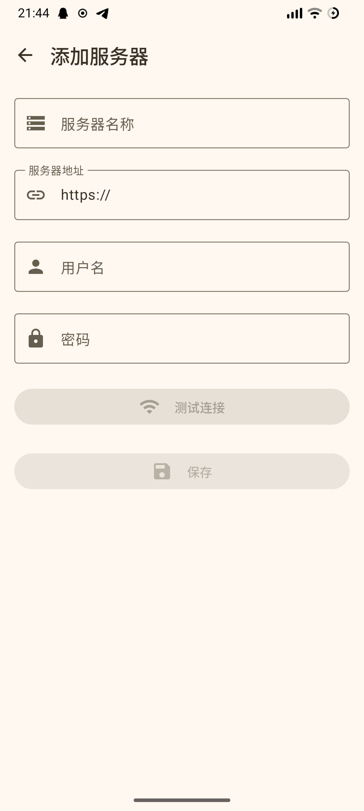 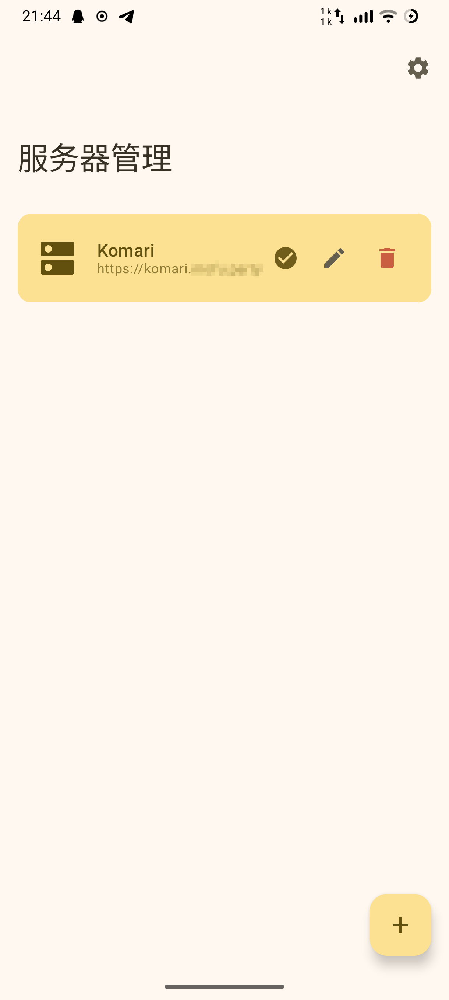
</p>

### 日间/浅色模式（手机）

<p style="text-align: center;">
     
</p>

### 日间/浅色模式（平板）

<p style="text-align: center;">
    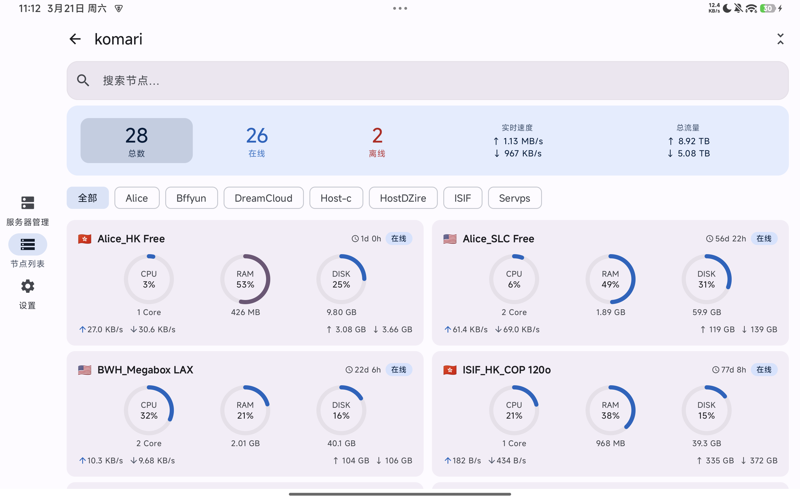
</p>

<p style="text-align: center;">
    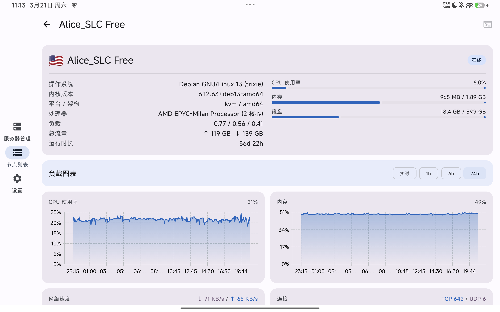
</p>

### 夜间/深色模式

<p style="text-align: center;">
    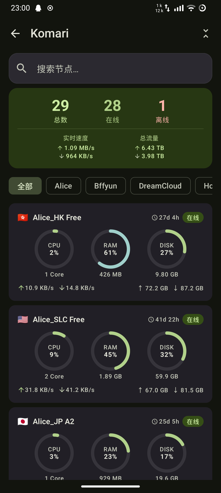 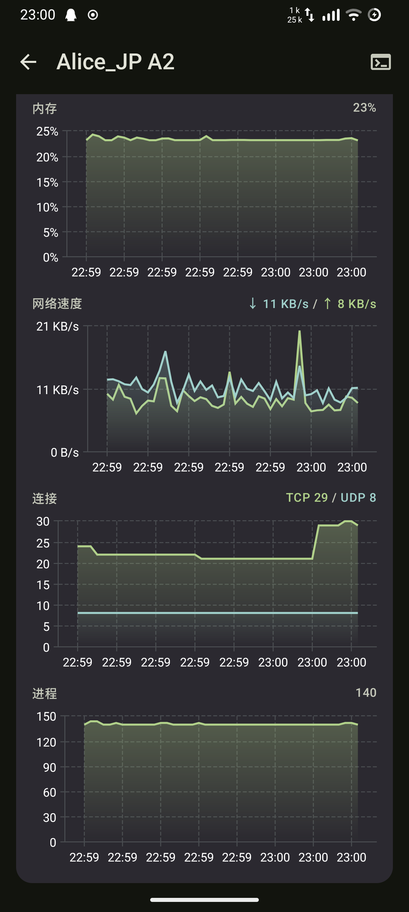
</p>

### 延迟监测/SSH终端

<p style="text-align: center;">
     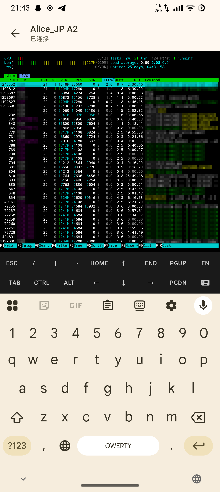
</p>

### 代码片段/Snippets

<p style="text-align: center;">
    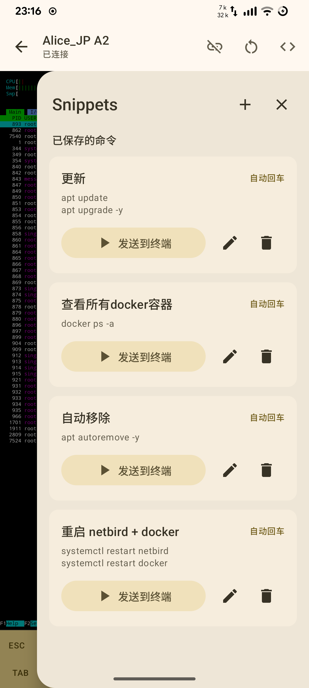 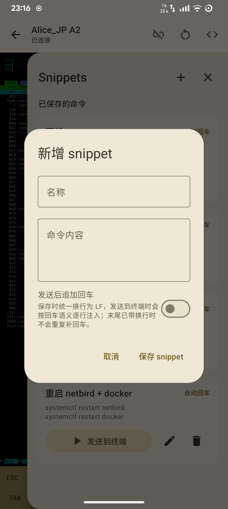
</p>

### 桌面小部件

<p style="text-align: center;">
    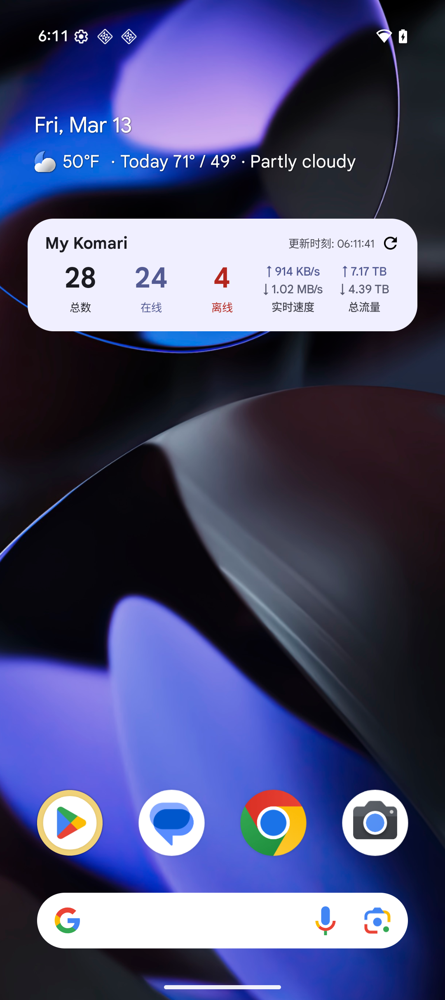 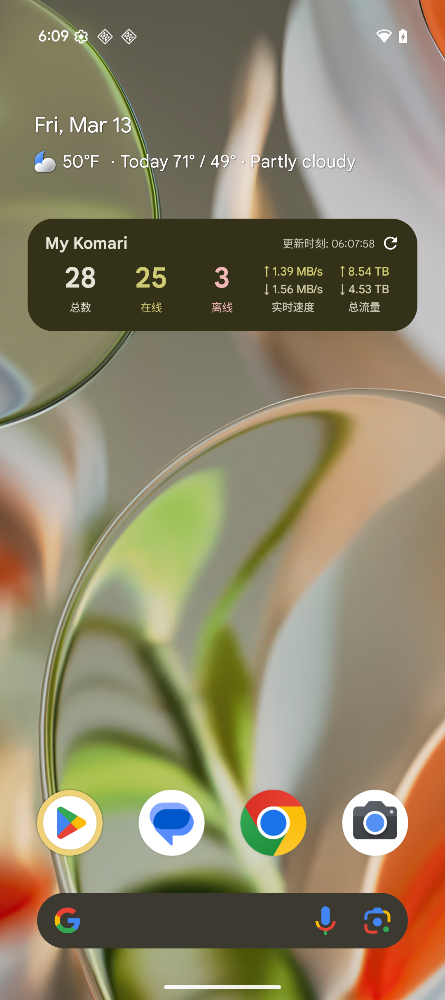
</p>

</details>

## 系统要求

| 项目 | 要求 |
|---|---|
| Android | 9.0（API 28）及以上 |
| iPhone | iOS 16 及以上 |
| 服务端 | Komari 1.1.7 及以上 |

## 构建

```bash
# Android Debug APK
(cd apps/android && ./gradlew assembleDebug)

# Android Release APK
(cd apps/android && ./gradlew assembleRelease)

# 清理后构建 Android Debug APK
(cd apps/android && ./gradlew clean assembleDebug)

# 未签名 iPhone IPA
BUILD_NUMBER=${GITHUB_RUN_NUMBER:-1}
BRANCH_REF=${GITHUB_REF_NAME:-local}
BRANCH_VERSION=$(printf '%s' "$BRANCH_REF" | tr '[:upper:]' '[:lower:]' | tr '/' '-' | sed -E 's/[^a-z0-9._-]+/-/g; s/-+/-/g; s/^-//; s/-$//')
SHORT_SHA=${GITHUB_SHA:-local}
SHORT_SHA=${SHORT_SHA:0:7}
VERSION="YanamiNext-Build-${BRANCH_VERSION:-local}-${SHORT_SHA}"
xcodebuild \
  -project apps/iphone/Yanami.xcodeproj \
  -scheme Yanami \
  -configuration Release \
  -sdk iphoneos \
  -destination 'generic/platform=iOS' \
  -derivedDataPath build/ios \
  CODE_SIGNING_ALLOWED=NO \
  CODE_SIGNING_REQUIRED=NO \
  CODE_SIGN_IDENTITY="" \
  DEVELOPMENT_TEAM="" \
  PROVISIONING_PROFILE_SPECIFIER="" \
  MARKETING_VERSION="1.0" \
  CURRENT_PROJECT_VERSION="$BUILD_NUMBER" \
  build
mkdir -p build/ios-ipa/Payload
ditto build/ios/Build/Products/Release-iphoneos/Yanami.app build/ios-ipa/Payload/YanamiNext.app
(cd build/ios-ipa && ditto -c -k --sequesterRsrc --keepParent Payload "../${VERSION}.ipa")
```

Android 构建产物位于 `apps/android/app/build/outputs/apk/`。CI 预发布产物使用 `YanamiNext-Build-<分支>-<短提交号>`；未签名 iPhone IPA 位于 `build/YanamiNext-Build-<分支>-<短提交号>.ipa`，安装到真机前需要使用者自行签名。

## 技术栈

| 库 | 版本 | 用途 |
|---|---|---|
| Kotlin | 2.3.10 | Android 主语言 |
| Swift | 5 | iPhone 主语言 |
| Jetpack Compose BOM | 2026.02.01 | Android UI 框架 |
| SwiftUI | iOS 16+ | iPhone UI 框架 |
| MD3 | — | Android 设计系统 |
| Voyager | 1.1.0-beta03 | 导航 + ScreenModel |
| Koin | 4.1.1 | 依赖注入 |
| Ktor | 3.4.1 | HTTP 客户端 + WebSocket |
| Room | 2.8.4 | 本地数据库（加密凭据存储） |
| Vico | 3.0.3 | 图表（Compose M3） |
| termux terminal-view | 0.119.0-beta.3 | 终端 ANSI/VT100 渲染 |
| DataStore Preferences | 1.2.0 | 用户偏好持久化 |

## 架构

Android 端采用 **MVI（Model-View-Intent）** 模式，并在根层加入自适配导航壳层：

```
UI Layer      MainActivity Root Shell + Voyager Screen + Compose UI + MviViewModel<State, Event, Effect>
Domain Layer  Repository 接口 + 领域模型（Node, ServerInstance …）
Data Layer    Repository 实现、Ktor、Room、DataStore
```

每个页面遵循 **Contract 模式**，以嵌套的 `State` / `Event` / `Effect` 描述该页面的完整 MVI 契约。

Android 端位于 `apps/android`，iPhone 端位于 `apps/iphone`，是原生 SwiftUI 工程。iPhone 源码拆分为 `Models`、`Services`、`Stores`、`Views`、`Utilities` 和 `Resources`，对应 Android 的领域/数据/UI 分层，同时使用原生 iOS API。

### 导航流

```
ServerListScreen → AddServerScreen
                 → NodeListScreen → NodeDetailScreen → SshTerminalScreen
                 → SettingsHubScreen → SettingsScreen / AboutScreen
```

### 认证与网络

- **PASSWORD** — 通过 `POST /api/login` 获取 `session_token`（支持 2FA）
- **API_KEY** — 直接使用 `Authorization: Bearer <api-key>`，无需登录流程
- **GUEST** — 不注入认证头，可访问监控数据接口和 WebSocket，但 SSH 终端不可用
- 凭据和会话数据以 AES/GCM 加密后存入 Room，启动时自动恢复
- WebSocket (`wss://host/api/rpc2`) 始终需要 `Origin` 头
- `SessionCookieInterceptor` / 网络层会根据 `authType` 自动注入 Cookie、Bearer 头或跳过认证头

### 自适配布局

- 手机/窄屏：保持标准 Voyager 栈式导航
- 平板横屏：使用根级 `NavigationRail` + 内容区布局
- 节点列表和服务器列表在大屏横屏下切换为多列卡片布局
- 节点详情页在大屏横屏下使用图表双列和信息双栏布局
- 表单页和设置页在大屏横屏下使用居中限宽或左右分区布局

## 许可证

本项目遵循 [MIT License](LICENSE)。
