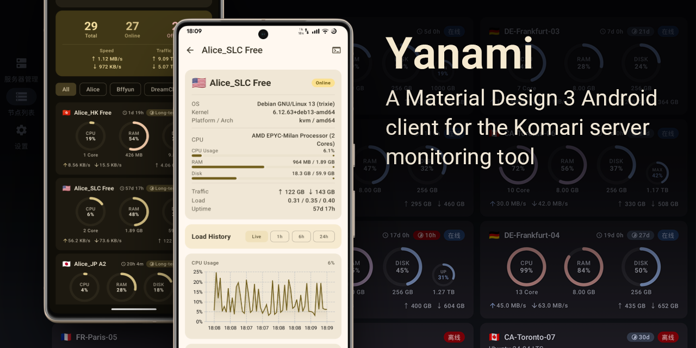
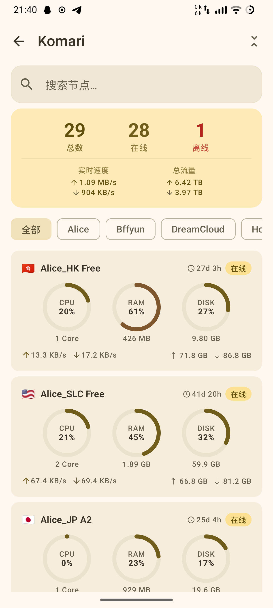
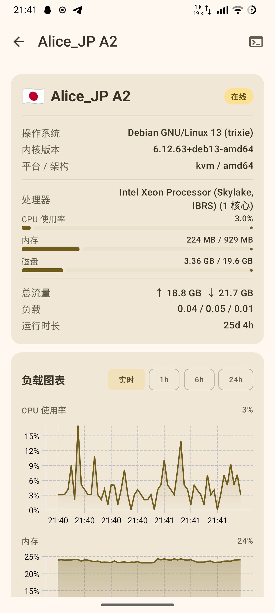
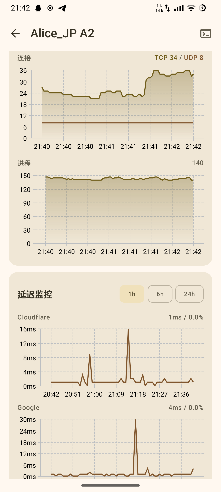

[English](README.md) | 简体中文

# Yanami

<p style="text-align: center;">
    
</p>

**Yanami** 是 [Komari](https://github.com/komari-monitor/komari) 服务器监控工具的 Android 客户端，采用 Material Design 3 设计语言构建。

> A Material Design 3 Android client for the Komari server monitoring tool.

---

## 功能特性

- **多实例管理** — 添加、编辑、切换多个 Komari 服务端实例
- **三种认证模式** — 支持密码、API Key 和游客模式认证
- **实时节点列表** — WebSocket 实时推送节点状态（CPU / RAM / 磁盘 / 网络 IO）
- **节点详情看板** — 负载历史折线图、Ping 延迟趋势、服务器基础信息
- **SSH 终端** — 基于 Terminal-view + WebSocket 的全功能 ANSI/VT100 终端，支持特殊按键工具栏与字号调整
- **桌面小部件** — 基于 Glance 的节点总览桌面小部件，支持刷新和更新间隔配置
- **平板横屏适配** — 提供 NavigationRail、大屏多列列表和详情双栏布局
- **多语言** — 中文（默认）、English、日本語
- **主题系统** — Material You 动态取色（Android 12+）+ 6 种预设配色，支持深色/浅色/跟随系统

## 截图

<details>

<summary>点击展开</summary>

### 实例管理

<p style="text-align: center;">
     
</p>

### 日间/浅色模式（手机）

<p style="text-align: center;">
     
</p>

### 日间/浅色模式（平板）

<p style="text-align: center;">
    
</p>

<p style="text-align: center;">
    
</p>

### 夜间/深色模式

<p style="text-align: center;">
     
</p>

### 延迟监测/SSH终端

<p style="text-align: center;">
     
</p>

### 代码片段/Snippets

<p style="text-align: center;">
     
</p>

### 桌面小部件

<p style="text-align: center;">
     
</p>

</details>

## 系统要求

| 项目 | 要求 |
|---|---|
| Android | 9.0（API 28）及以上 |
| 服务端 | Komari 1.1.7 及以上 |

## 构建

```bash
# Debug APK
./gradlew assembleDebug

# Release APK
./gradlew assembleRelease

# 清理后构建
./gradlew clean assembleDebug
```

构建产物位于 `app/build/outputs/apk/`。

## 技术栈

| 库 | 版本 | 用途 |
|---|---|---|
| Kotlin | 2.3.10 | 主语言 |
| Jetpack Compose BOM | 2026.02.01 | UI 框架 |
| MD3 | — | 设计系统 |
| Voyager | 1.1.0-beta03 | 导航 + ScreenModel |
| Koin | 4.1.1 | 依赖注入 |
| Ktor | 3.4.1 | HTTP 客户端 + WebSocket |
| Room | 2.8.4 | 本地数据库（加密凭据存储） |
| Vico | 3.0.3 | 图表（Compose M3） |
| termux terminal-view | 0.119.0-beta.3 | 终端 ANSI/VT100 渲染 |
| DataStore Preferences | 1.2.0 | 用户偏好持久化 |

## 架构

采用 **MVI（Model-View-Intent）** 模式，并在根层加入自适配导航壳层：

```
UI Layer      MainActivity Root Shell + Voyager Screen + Compose UI + MviViewModel<State, Event, Effect>
Domain Layer  Repository 接口 + 领域模型（Node, ServerInstance …）
Data Layer    Repository 实现、Ktor、Room、DataStore
```

每个页面遵循 **Contract 模式**，以嵌套的 `State` / `Event` / `Effect` 描述该页面的完整 MVI 契约。

### 导航流

```
ServerListScreen → AddServerScreen
                 → NodeListScreen → NodeDetailScreen → SshTerminalScreen
                 → SettingsHubScreen → SettingsScreen / AboutScreen
```

### 认证与网络

- **PASSWORD** — 通过 `POST /api/login` 获取 `session_token`（支持 2FA）
- **API_KEY** — 直接使用 `Authorization: Bearer <api-key>`，无需登录流程
- **GUEST** — 不注入认证头，可访问监控数据接口和 WebSocket，但 SSH 终端不可用
- 凭据和会话数据以 AES/GCM 加密后存入 Room，启动时自动恢复
- WebSocket (`wss://host/api/rpc2`) 始终需要 `Origin` 头
- `SessionCookieInterceptor` / 网络层会根据 `authType` 自动注入 Cookie、Bearer 头或跳过认证头

### 自适配布局

- 手机/窄屏：保持标准 Voyager 栈式导航
- 平板横屏：使用根级 `NavigationRail` + 内容区布局
- 节点列表和服务器列表在大屏横屏下切换为多列卡片布局
- 节点详情页在大屏横屏下使用图表双列和信息双栏布局
- 表单页和设置页在大屏横屏下使用居中限宽或左右分区布局

## 许可证

本项目遵循 [MIT License](LICENSE)。
